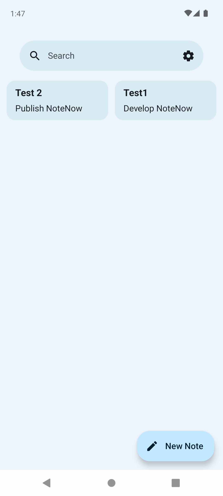
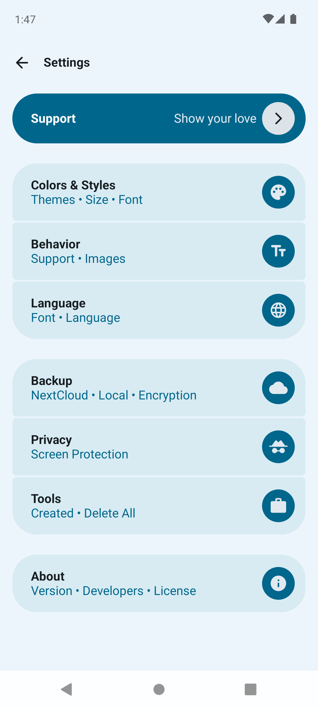
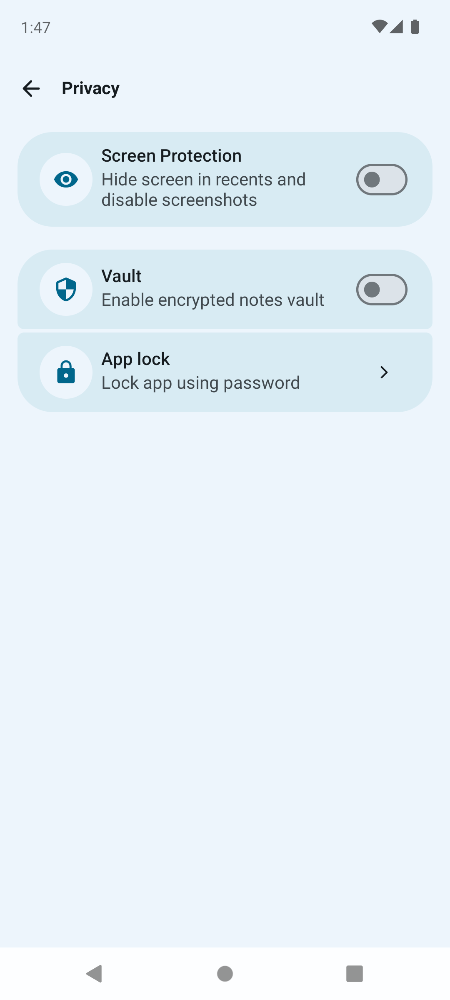

# 📝 NoteNow

**NoteNow** is a modern, lightweight note-taking Android application built using **Kotlin** and **Jetpack Compose**. It offers a fast, intuitive, and distraction-free experience for capturing your thoughts, tasks, and ideas.

## 🚀 Features

- ✨ Beautiful UI with Jetpack Compose
- 🗂️ Create, edit, and delete notes easily
- 🔍 Search functionality to find notes quickly
- 📌 Pin important notes
- 🌓 Dark mode support
- 💾 Data persistence with Room and DataStore
- 🔐 Optional biometric authentication (if enabled)
- 🖼️ Image loading with Coil
- 🧩 App widget support using Glance

## 🛠 Built With

- **Kotlin**
- **Jetpack Compose**
- **Room Database**
- **Hilt for Dependency Injection**
- **DataStore Preferences**
- **AndroidX Navigation**
- **Coil (Image loading)**
- **Glance (App Widgets)**
- **Biometric API**
- **Material 3 UI Components**

## 📸 Screenshots
<p float="left">
  
  
  
</p>
## 📦 Setup & Installation

1. Clone the repository:
   ```bash
   git clone https://github.com/Amlakie-T/NoteNow.git
